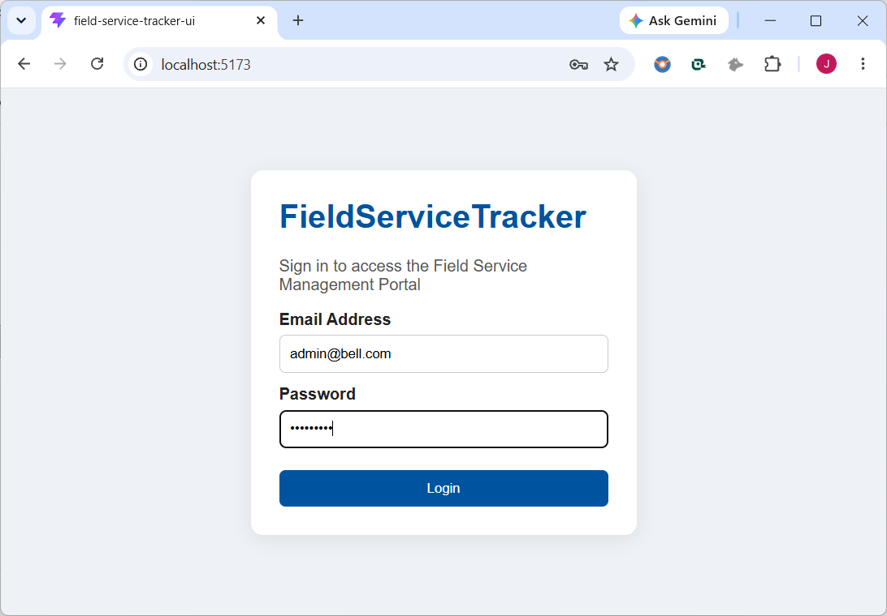
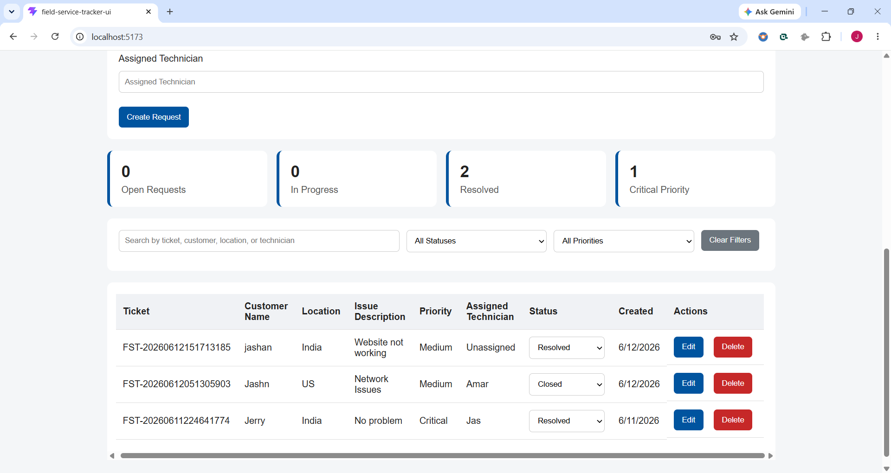
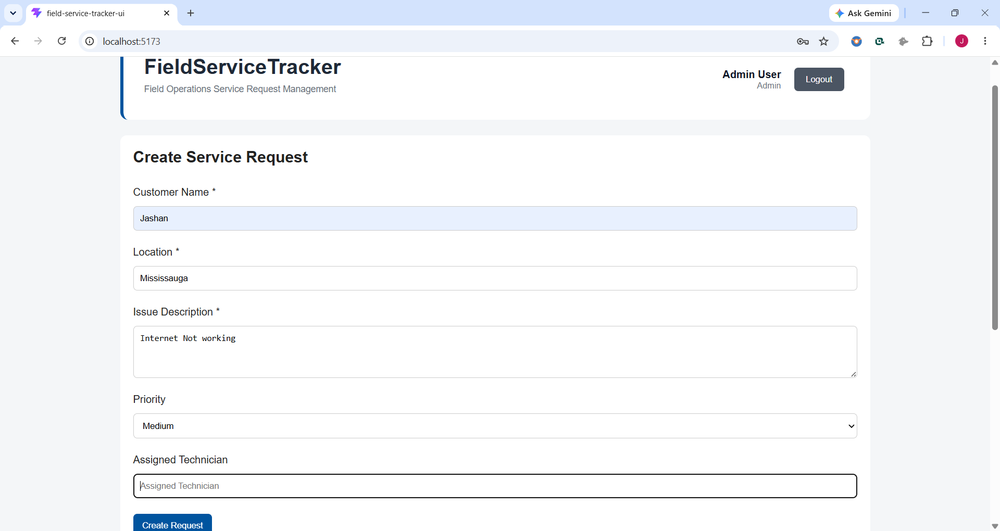
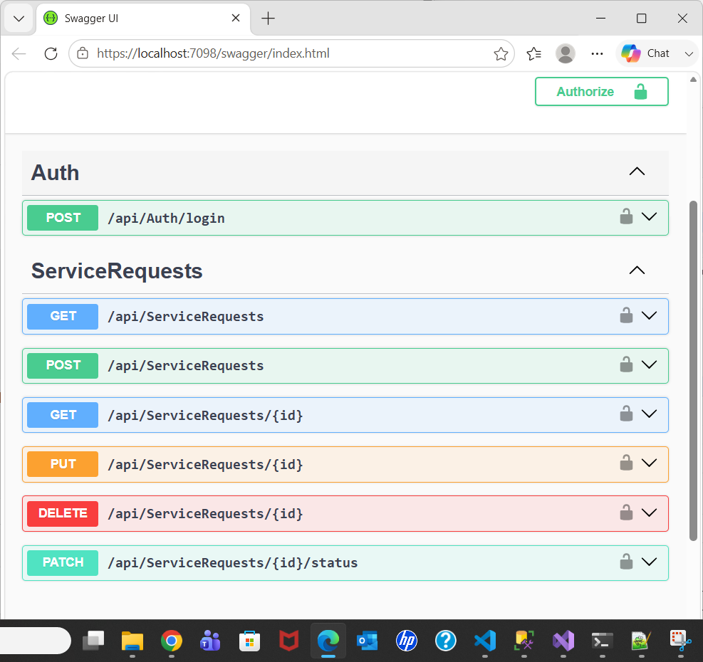
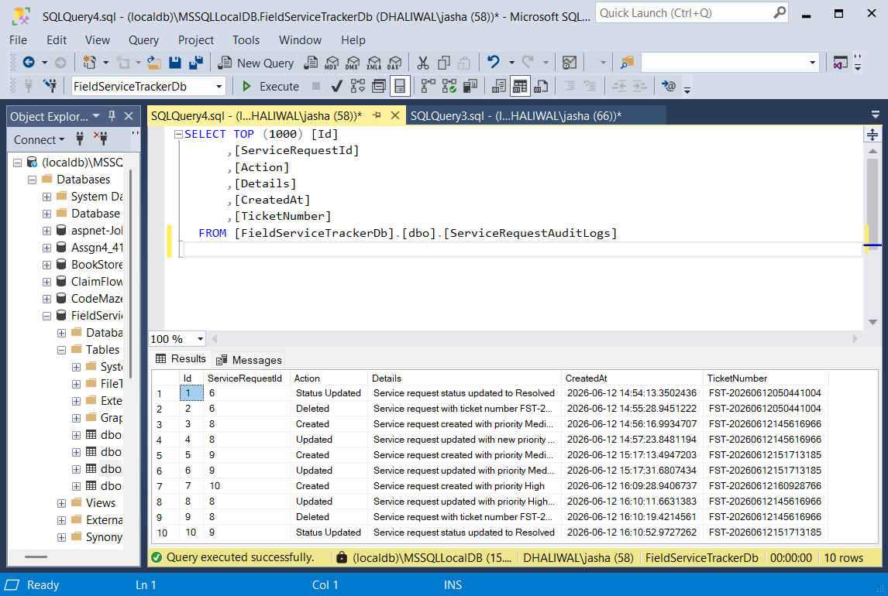

# FieldServiceTracker

## Overview

FieldServiceTracker is a full-stack web application built to help Field Services teams create, manage, track, and update service requests. The application demonstrates end-to-end data interaction between a React frontend, ASP.NET Core Web API backend, and SQL Server database.

The project was developed using a layered architecture and follows modern software development practices including dependency injection, validation, logging, exception handling, RESTful APIs, and separation of concerns.

---

## Screenshots

### Login Page



### Dashboard



### Create Service Request



### Swagger API Testing



### Audit Log Records



---

## Features

### Service Request Management

* Create new service requests
* View all service requests
* Update existing service requests
* Delete service requests
* Update request status independently using PATCH
* Assign technicians to service requests

### Search & Filtering

* Filter requests by Status
* Filter requests by Priority
* Search by:

  * Ticket Number
  * Customer Name
  * Location
  * Assigned Technician

### Dashboard Summary

Displays real-time counts for:

* Open Requests
* In Progress Requests
* Resolved Requests
* Critical Priority Requests

### Authentication

* JWT-based login
* Protected API endpoints
* BCrypt password hashing

### Audit Logging

Tracks important actions performed on service requests:

* Created
* Updated
* Status Changed
* Deleted

### User Experience Enhancements

* Loading indicator while data is being fetched
* Success messages after operations
* Error handling with meaningful feedback
* Empty-state messaging when no records match filters
* Delete confirmation prompt

---

## Technology Stack

### Backend

* ASP.NET Core Web API (.NET 8)
* C#
* Entity Framework Core
* SQL Server
* FluentValidation
* Serilog
* JWT Authentication

### Frontend

* React
* Vite
* Axios
* CSS

### Tools

* Visual Studio 2022
* Visual Studio Code
* Git
* GitHub
* Swagger / OpenAPI
* SQL Server Management Studio (SSMS)

---

## Key Technical Features

* Layered Architecture
* Dependency Injection
* Repository Pattern
* DTO Pattern
* FluentValidation
* Global Exception Handling Middleware
* Structured Logging with Serilog
* SQL Server Persistence
* Entity Framework Core Migrations
* JWT Authentication
* Audit Logging
* RESTful API Design
* Filtering and Search
* Loading and Error States
* HTTP Status Code Handling

---

## Solution Structure

```text
FieldServiceTracker
│
├── FieldServiceTracker.sln
│
├── backend
│   └── FieldServiceTracker.API
│       ├── Controllers
│       ├── Data
│       ├── DTOs
│       ├── Exceptions
│       ├── Middleware
│       ├── Models
│       ├── Repositories
│       ├── Services
│       ├── Validators
│       └── Migrations
│
├── frontend
│   └── field-service-tracker-ui
│       ├── api
│       ├── components
│
├── screenshots
│
└── README.md
```

---

## Architecture

The application follows a layered architecture:

### Controller Layer

Handles HTTP requests and returns appropriate responses.

### Service Layer

Contains business logic and application rules.

### Repository Layer

Handles database access and persistence operations.

### DTO Layer

Transfers data between the API and client while preventing direct exposure of database entities.

### Validation Layer

Uses FluentValidation to validate incoming requests before processing.

### Middleware Layer

Provides centralized exception handling and consistent API responses.

---

## Design Decisions

### Dependency Injection

Dependency Injection is used throughout the application to improve maintainability, testability, and loose coupling between layers.

Examples:

* IServiceRequestService
* IServiceRequestRepository
* AppDbContext

### Validation

FluentValidation validates incoming requests before database operations.

Examples:

* Customer Name is required
* Location is required
* Issue Description is required
* Priority must be:

  * Low
  * Medium
  * High
  * Critical
* Status must be:

  * Open
  * In Progress
  * Resolved
  * Closed

### Logging

Serilog captures application events and errors.

Examples:

* Service request created
* Service request updated
* Service request deleted
* Status changed
* Unexpected exceptions

### Exception Handling

A global exception middleware is implemented to:

* Catch unhandled exceptions
* Log errors
* Return consistent API responses

Examples:

* 404 Not Found
* 500 Internal Server Error

### Audit Logging

A dedicated audit log table records important changes made to service requests. This provides traceability and helps track user actions within the system.

### Duplicate Data Prevention

Ticket numbers are generated uniquely and a unique database index prevents duplicate service requests.

### Timeout Handling

Axios is configured with a timeout to prevent the UI from waiting indefinitely if backend services become unavailable.

---

## REST API Endpoints

| Method | Endpoint                         | Description       |
| ------ | -------------------------------- | ----------------- |
| POST   | /api/Auth/login                  | User Login        |
| GET    | /api/ServiceRequests             | Get All Requests  |
| GET    | /api/ServiceRequests/{id}        | Get Request By Id |
| POST   | /api/ServiceRequests             | Create Request    |
| PUT    | /api/ServiceRequests/{id}        | Update Request    |
| PATCH  | /api/ServiceRequests/{id}/status | Update Status     |
| DELETE | /api/ServiceRequests/{id}        | Delete Request    |

---

## HTTP Status Codes Used

| Status Code | Description           |
| ----------- | --------------------- |
| 200         | OK                    |
| 201         | Created               |
| 204         | No Content            |
| 400         | Bad Request           |
| 401         | Unauthorized          |
| 404         | Not Found             |
| 500         | Internal Server Error |

---

## Database Setup

Update the connection string in:

```text
appsettings.json
```

Example:

```json
{
  "ConnectionStrings": {
    "DefaultConnection": "Server=(localdb)\\MSSQLLocalDB;Database=FieldServiceTrackerDb;Trusted_Connection=True;MultipleActiveResultSets=true"
  }
}
```

### Run Migrations

Package Manager Console:

```powershell
Update-Database
```

---

## Running the Backend

Navigate to:

```text
backend/FieldServiceTracker.API
```

Run:

```bash
dotnet restore
dotnet run
```

Swagger UI:

```text
https://localhost:7098/swagger
```

---

## Running the Frontend

Navigate to:

```text
frontend/field-service-tracker-ui
```

Install dependencies:

```bash
npm install
```

Run:

```bash
npm run dev
```

Application:

```text
http://localhost:5173
```

---

## Why React?

Bell's preferred frontend stack includes Angular, and I have previous Angular experience from professional work. However, for this assessment I chose React because I have recently built projects using React and could deliver a cleaner and more polished solution within the given timeline.

The backend remains aligned with Bell's preferred stack using ASP.NET Core, C#, SQL Server, Entity Framework Core, REST APIs, validation, logging, dependency injection, and Swagger.

---

## Future Enhancements

* Role-Based Authorization
* Pagination
* Email Notifications
* Export to Excel/CSV
* Unit Testing using xUnit and Moq
* Docker Containerization
* Azure Deployment
* CI/CD Pipeline

---

## Conclusion

The primary goal of this project was to demonstrate clean architecture, maintainability, code quality, and practical software engineering principles while keeping the solution simple, extensible, and easy to understand. The application showcases frontend-to-backend-to-database interaction, validation, exception handling, logging, authentication, audit tracking, and modern development practices commonly used in enterprise applications.
